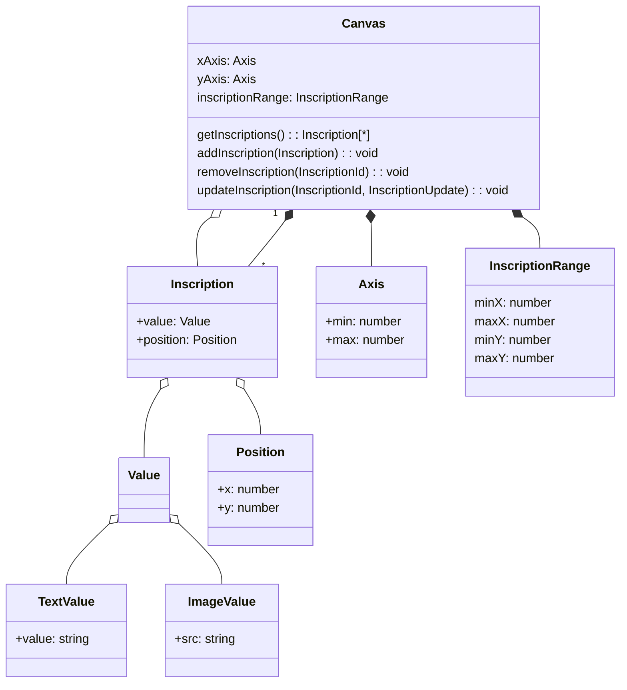

# The Plan

## UI

Our user's name is Chandler.

Chandler should be able to pan and zoom a screen that displays all `Inscriptions`, showing each one at the location where it was created.

Chandler should be able to add a new `Inscription` by clicking somewhere on the `Canvas`, revealing an `InscriptionBuilder` UI that allows them to add an new positioned `Inscription`.

## Model

This is located in `Model.mmd`.

## API

### Allow `Inscriptions` to be added to the `Canvas`
User should be able to submit new `Inscription`s to a single `Canvas`.

### Expand the `Canvas` range when necessary
Check after every `Inscription` added if we need to expand the `inscriptionRange`. To start, let's expand the range to all borders of the outermost `Inscriptions`. In other words, the outermost `Inscriptions` should butt up against the walls. This would result in a `Canvas` that grows to fit the content added.

## Model

